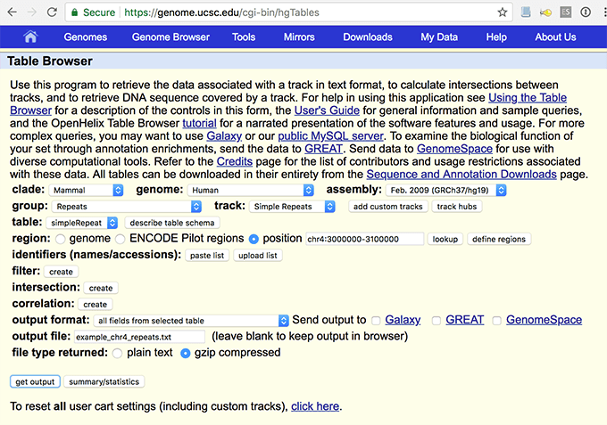

```{r setup, include = FALSE}
knitr::opts_chunk$set(
  collapse = TRUE,
  comment = "#>"
)
```

Alongside the exSTRa specific format for specifying repeat loci, 
exSTRa may also use short tandem repeats (STRs) from the 
[UCSC Simple Repeats track](http://genome.ucsc.edu/cgi-bin/hgTables?db=hg19&hgta_group=rep&hgta_track=simpleRepeat&hgta_table=simpleRepeat&hgta_doSchema=describe+table+schema).
This allows the user to easily analyse other known STRs, even if they are not known
to be pathogenic. 

The human hg19 UCSC Simple Repeats track contains close to one million entries. 
Many of these are tandem repeats of long motifs (>6 bp). 
Approximately a quarter of a million of these have repeat motifs (consensusSize) from 2 to 
6 bp, that we define as STRs. 
At present, exSTRa filters all other motif lengths before analysis. 
We recommend only analysing a subset of STRs at present due to computational complexity;
improving the speed of our algorithms is future work.

Note that for some loci, "period" (length of repeat unit) does not match
the "consensusSize" (length of consensus sequence).
This discrepency is caused by non-pure tandem repeats, with indels relative to a pure
tandem repeat.
As consensusSize gives the length of the given motif, exSTRa uses this as the motif length.

# Obtaining Simple Repeats data

Here we only describe downloading Simple Repeats track data for the human hg19 reference.
One option is to use the UCSC Table Browser, that allows easy subsetting to a region(s)
of the data. 
Alternatively, you may download the entire simple repeats track, 
that may be filtered locally.

## Using the UCSC Table Browser

The UCSC Table Browser allows downloading
a subsection of UCSC data. 
If you are interested in a particular region, you may first find the region in the
Genome Browser; the position should carry over to the Table Browser. 
The Table Browser is found in the "Tools" menu, or head directly to  https://genome.ucsc.edu/cgi-bin/hgTables.

An example of the settings used is provided in this figure:




In detail, the settings to use are as follows. 
The drop down menus will need to be completed in order (if not already properly set) as
follows:

* clade: Mammal
* genome: Human
* assembly: Feb. 2009 (GRCh37/hg19)
* group: Repeats
* track: Simple Repeats
* table: simpleRepeat
* ouput format: all fields from selected table (note this is a little further down the page)

Select the "region" as approprate; for position use chrN:start-end format.

The "identifiers (names/accessions)", "intersection" and "correlation" buttons may be ignored.
The "filter" option may be useful if you are only interested in some repeats;
note that sequences may start on any part of the motif cycle and/or be 
reverse complemented. 

Enter an output file name ending with `.txt`.
For "file type returned", you may choose either option, but will require to inflate a 
compressed file for Bio::STR::exSTRa. 
Use the "get outout" button to obtain output. 

## Downloading the Simple Repeats track

The full simple repeats track data should be obtainable from http://hgdownload.soe.ucsc.edu/goldenPath/hg19/database/simpleRepeat.txt.gz. 

This path was obtained from the 
[downloads page](http://hgdownload.soe.ucsc.edu/downloads.html) on UCSC Genome
Browser, following the human data of build "Feb. 2009 (GRCh37/hg19)", under 
[http://hgdownload.soe.ucsc.edu/goldenPath/hg19/database/]("Annotation database").

This file does not contain a header, and thus may be filtered to keep only lines of 
interest. 
The columns descriptions can be found at [UCSC Simple Repeats track](http://genome.ucsc.edu/cgi-bin/hgTables?db=hg19&hgta_group=rep&hgta_track=simpleRepeat&hgta_table=simpleRepeat&hgta_doSchema=describe+table+schema),
with names:
bin, chrom, chromStart, chromEnd, name, period, copyNum, consensusSize, perMatch, 
perIndel, score, A, C, G, T, entropy, sequence.